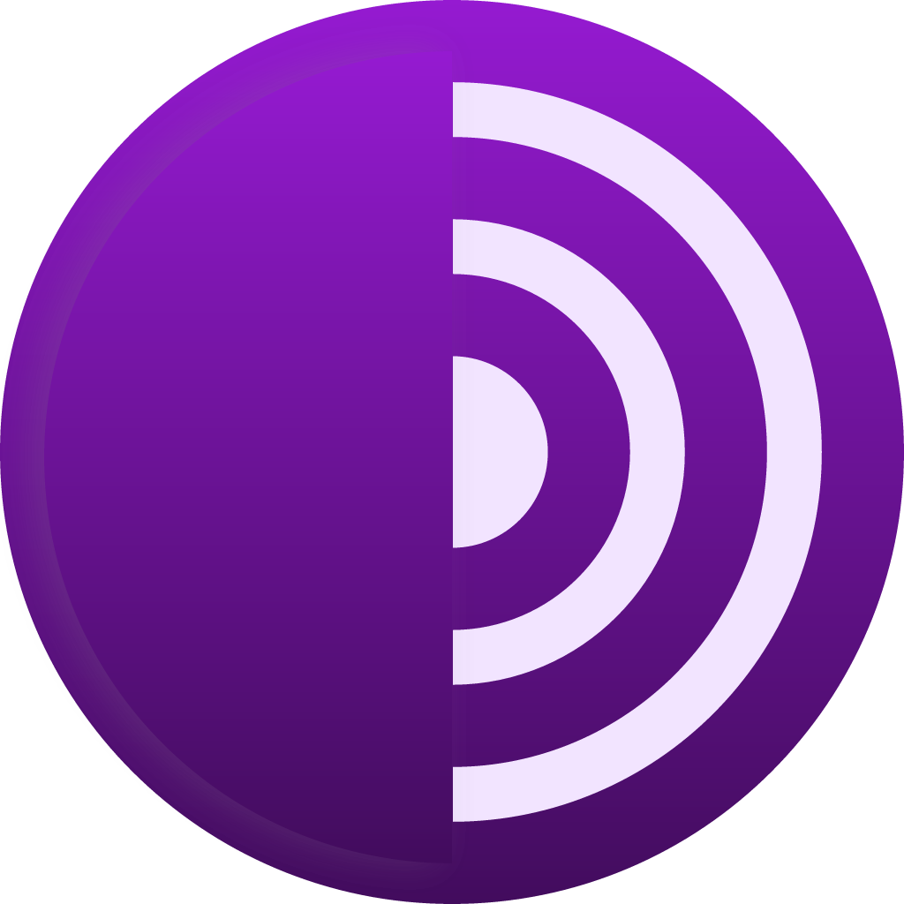

# Shutdown Tools 

A collection of tools, websites, strategies that could be used by HRDs, journalists, and anyone, **during internet outages**. 

If you are a tool developer and think your tool should be included in this directory, or would like to submit user feedback for a tools, please contact the team at hello@shutdown.tools. 

If you would like to help in categorising these projects, please submit a pull request to [this repo](https://github.com/stayteef/shutdown.tools).

----
## Alternative Internet

<!-- e-SIM -->

<!-- LOGO-->
{ align=right width=88 }

<!-- NAME -->
### e-SIM

<!-- description-->
Using an **e-SIM** allows you to activate a foreign mobile data plan without needing to insert a physical card into your device. It enables you to switch between different mobile networks and access alternative providers that may still be operational, ensuring connectivity even when local networks are restricted.

<!-- info-->
**Platforms:** [:simple-android:](URL){ title="Android" } [:simple-apple:](URL){ title="iOS" }

<!-- RISKS -->
!!! warning "Risks"

    - It may not be a good solution in areas with a complete network outage, or where all providers are affected.

<!-- PREPARE -->
!!! warning "Must test first"

    - Get the e-SIM BEFORE a shutdown happens, and test that it actually works on your device and carrier. You need to make sure.

<!-- WARNING/REMINDER-->

<!-- REVIEWS-->

<!-- Iodine -->

<!-- LOGO-->
{ align=right width=88 }

<!-- NAME -->
### Iodine

<!-- description-->
⚠️ **Highly technical. Requires real networking skill to set up. Not beginner-friendly.**

**Iodine** is a tool that can sneak your internet traffic past certain kinds of blocks. During SOME shutdowns, authorities don't switch off the network completely. They leave a few small background channels open, because phones and computers need them just to function. Iodine hides your internet traffic inside one of those still-open channels, letting it slip past the block. The channel it uses is called DNS, the system that looks up website names, which is often left working even when normal internet is cut off.

<!-- info-->
**Platforms:** :material-console:{ title="Command line" } [:simple-linux:](URL){ title="Linux" }  
**Open source:** :material-check:

[:octicons-globe-16: Official website](https://code.kryo.se/iodine/){ .md-button }

!!! info "When it won't help"

    Iodine only works in a limited set of cases, and whether it works depends on a lot of factors, for example, whether DNS is still allowed (which is not easy to check), which DNS provider you're routed through, and your own technical skill. **It does nothing in these cases:**

    - If DNS is blocked in your country.

    - A total blackout, where the network is fully switched off.

    - Physical damage or a power cut that takes the network down entirely.

    - Countries or networks that filter or heavily restrict DNS.

<!-- WARNING/REMINDER-->

<!-- Satellite Internet -->

<!-- LOGO-->
{ align=right width=88 }

<!-- NAME -->
### Satellite Internet

<!-- description-->
**Satellite internet** works like normal internet, but it's provided by a company like SpaceX instead of your local ISP, bypassing the local network your authorities control. There are a few providers on the market. The most common is Starlink by SpaceX. It involves a one time hardware kit and a monthly subscription. When making a decision, consider factors such as usability, legality, cost, and latency.

<!-- info-->
**Platforms:** :material-chip:{ title="Hardware" }  
**Open source:** :material-close: &nbsp;·&nbsp; **Non-profit:** :material-close:

| Provider   | Speed Range                     | Starting Monthly Cost | Regular Monthly Cost | Contract | Monthly Equipment Costs               | Data Cap                     | Owned By                     |
|------------|----------------------------------|-----------------------|----------------------|----------|---------------------------------------|-------------------------------|------------------------------|
| Hughesnet  | 25-100 Mbps download, 5 Mbps upload | $50-$95               | $75-$120             | 2 years  | $10-$20 a month or $300-$450 one-time purchase | Unlimited, 100-200 GB (soft cap) | [EchoStar](https://www.echostar.com) |
| Starlink   | 100-350 Mbps download, 5-25 Mbps upload | $80-$120              | $80-$120             |          | $349 (currently discounted to $89) one-time purchase for Standard | Unlimited | [SpaceX](https://www.spacex.com) |
| Viasat     | 25-150 Mbps download, 3 Mbps upload | $70-$100              | $70-$100             | None     | $15 or $250 one-time purchase         | Unlimited, 850 GB (soft cap) | [Viasat Inc.](https://www.viasat.com) |

<!-- RISKS -->
!!! warning "Risks"

    - In some countries it is not legal to obtain or use Starlink.
    - If you prefer not to be detected, be cautious of RF emissions and unplug the device when not in use.

<!-- WARNING/REMINDER-->
!!! danger "Warning"

    Please be aware of the risks of being detected using satellite internet.
    The Iranian community created [a guide on how to mitigate the risks of being detected](https://www.starlink4iran.com/faqs/general-install/%d8%a7%d8%b3%d8%aa%d8%aa%d8%a7%d8%b1-%d9%81%db%8c%d8%b2%db%8c%da%a9%db%8c-%d8%af%d8%b3%d8%aa%da%af%d8%a7%d9%87-%d8%a7%d8%b3%d8%aa%d8%a7%d8%b1%d9%84%db%8c%d9%86%da%a9/). It's only available in Persian.

<!-- REVIEWS-->

---

## App Store

<!-- Second Wind -->

<!-- LOGO-->
{ align=right width=88 }

<!-- NAME -->
### Second Wind

<!-- description-->
**Second Wind** is an offline distribution system for Android apps.

<!-- info-->
**Platforms:** [:simple-android:](URL){ title="Android" } [:simple-fdroid:](URL){ title="F-Droid" }  
**Open source:** :material-check: &nbsp;·&nbsp; **Non-profit:** :material-check:

[:octicons-globe-16: Official website](https://secondwind.guardianproject.info/en/repo){ .md-button }

<!-- RISKS -->

<!-- WARNING/REMINDER-->

<!-- REVIEWS-->

User reviews

<!-- add reviews here -->

<!-- Paskoocheh -->

<!-- LOGO-->
{ align=right width=88 }

<!-- NAME -->
### Paskoocheh

<!-- description-->
**Paskoocheh**, Persian for "alleyway", is an app store for Iranians to access tools for secure communication, information sharing, and censorship circumvention.

<!-- info-->
**Platforms:** [:simple-android:](URL){ title="Android" } [:simple-apple:](URL){ title="iOS" } [:fontawesome-brands-windows:](URL){ title="Windows" }  
**Non-profit:** :material-check:

[:octicons-globe-16: Official website](https://paskoocheh.com/){ .md-button }

<!-- RISKS -->

<!-- WARNING/REMINDER-->

<!-- REVIEWS-->

User reviews

<!-- add reviews here -->

---

## Browser

<!-- Ceno Browser -->

<!-- LOGO-->
{ align=right width=88 }

<!-- NAME -->
### Ceno Browser

<!-- description-->
**Ceno Browser** is a decentralized mobile web browser designed to keep some connectivity during network blackouts. It uses peer-to-peer technology, so instead of loading a page only from the website itself, it can fetch what other Ceno users have already seen. Ceno still needs some kind of network path to reach other users or the helper servers, for example someone in the country with Ceno installed who still has internet access (such as through Starlink, or because they work in government). But it cannot work where no network path exists at all.

<!-- info-->
**Platforms:** [:simple-apple:](https://apps.apple.com/us/app/ceno-browser/id6673915387){ title="iOS" } [:simple-android:](https://play.google.com/store/apps/details?id=ie.equalit.ceno&pcampaignid=pcampaignidMKT-Other-global-all-co-prtnr-py-PartBadge-Mar2515-1){ title="Android" } [:fontawesome-brands-windows:](https://ceno-download.s3.amazonaws.com/ceno-desktop/latest/ceno-win64-portable.html){ title="Windows" }  
**Open source:** :material-check: &nbsp;·&nbsp; **Non-profit:** :material-check:

[:octicons-globe-16: Official website](https://ceno.app/en/index.html){ .md-button }

<!-- RISKS -->
!!! warning "Risks"

    - Ceno is not anonymous. There are different ways people can see your [IP][ip], for example in Public mode, or through helper servers (Injectors and Bridges).
    - It can use a lot of data.

    Use Personal mode to stay off the sharing network. For more, see the [Ceno FAQ](https://ceno.app/faq/).

<!-- WARNING/REMINDER-->

<!-- REVIEWS-->

<!-- Tor -->

<!-- LOGO-->
{ align=right width=88 }

<!-- NAME -->
### Tor

<!-- description-->
The **Tor Browser** is a privacy-focused web browser that routes internet traffic through the Tor network, anonymizing users' online activity potentially from your ISP and government. It can bypass certain kinds of censorship by allowing access to blocked sites through encrypted connections.

<!-- info-->
**Platforms:** [:simple-android:](https://play.google.com/store/apps/details?id=org.torproject.torbrowser){ title="Android" } [:fontawesome-brands-windows:](https://www.torproject.org/dist/torbrowser/15.0.20/tor-browser-windows-x86_64-portable-15.0.20.exe){ title="Windows" } [:material-apple:](https://www.torproject.org/dist/torbrowser/15.0.20/tor-browser-macos-15.0.20.dmg){ title="macOS" } [:simple-linux:](https://www.torproject.org/dist/torbrowser/15.0.20/tor-browser-linux-x86_64-15.0.20.tar.xz){ title="Linux" }  
**Open source:** :material-check: &nbsp;·&nbsp; **Non-profit:** :material-check:

[:octicons-globe-16: Official website](https://www.torproject.org/){ .md-button }

<!-- RISKS -->

<!-- WARNING/REMINDER-->

<!-- REVIEWS-->

User reviews

<!-- add reviews here -->

---

## Camera

<!-- eyeWitness to Atrocities -->

<!-- LOGO-->
{ align=right width=88 }

<!-- NAME -->
### eyeWitness to Atrocities

<!-- description-->
The **eyeWitness to Atrocities** app lets you capture photos and videos with embedded metadata to verify their authenticity in court.

<!-- info-->
**Platforms:** [:simple-android:](URL){ title="Android" }  
**Non-profit:** :material-check:

[:octicons-globe-16: Official website](https://www.eyewitness.global/){ .md-button }

<!-- RISKS -->

<!-- WARNING/REMINDER-->

<!-- REVIEWS-->

User reviews

<!-- add reviews here -->

<!-- Tella -->

<!-- LOGO-->
{ align=right width=88 }

<!-- NAME -->
### Tella

<!-- description-->
Take photos, record videos and audio directly in **Tella** so that your files are immediately encrypted and hidden in the app, preventing authorities from finding photos or videos in your phone album.

<!-- info-->
**Platforms:** [:simple-apple:](URL){ title="iOS" } [:simple-android:](URL){ title="Android" } [:simple-fdroid:](URL){ title="F-Droid" }  
**Open source:** :material-check: &nbsp;·&nbsp; **Non-profit:** :material-check:

[:octicons-globe-16: Official website](https://tella-app.org/){ .md-button }

<!-- RISKS -->

<!-- WARNING/REMINDER-->

<!-- REVIEWS-->

User reviews

<!-- add reviews here -->

---

## Communication

<!-- Briar -->

<!-- LOGO-->
{ align=right width=88 }

<!-- NAME -->
### Briar

<!-- description-->
**Briar** is censorship-resistant peer-to-peer messaging that bypasses centralized servers. It allows you to privately connect via Bluetooth, Wi-Fi or Tor.

<!-- info-->
**Platforms:** [:simple-android:](https://play.google.com/store/apps/details?id=org.briarproject.briar.android){ title="Android" } [:simple-fdroid:](https://briarproject.org/fdroid){ title="F-Droid" }  
**Open source:** :material-check: &nbsp;·&nbsp; **Non-profit:** :material-check:

[:octicons-globe-16: Official website](https://briarproject.org/){ .md-button }

<!-- RISKS -->

<!-- WARNING/REMINDER-->

<!-- REVIEWS-->

User reviews

<!-- add reviews here -->

<!-- Bridgefy -->

<!-- LOGO-->
{ align=right width=88 }

<!-- NAME -->
### Bridgefy

<!-- description-->
**Bridgefy** is a free messaging app that works without the internet.

<!-- info-->
**Platforms:** [:simple-android:](https://play.google.com/store/apps/details?id=me.bridgefy.main){ title="Android" } [:simple-apple:](https://apps.apple.com/us/app/bridgefy-offline-messages/id975776347){ title="iOS" }  
**Open source:** :material-close: &nbsp;·&nbsp; **Non-profit:** :material-close:

[:octicons-globe-16: Official website](https://bridgefy.me/){ .md-button }

<!-- RISKS -->

<!-- WARNING/REMINDER-->

<!-- REVIEWS-->

User reviews

<!-- add reviews here -->

<!-- Deku SMS -->

<!-- LOGO-->
{ align=right width=88 }

<!-- NAME -->
### Deku SMS

<!-- description-->
**DekuSMS** is an Android SMS app that allows you to encrypt your SMS.

<!-- info-->
**Platforms:** [:simple-android:](URL){ title="Android" }  
**Open source:** :material-check:

[:octicons-globe-16: Official website](https://dekusms.com/){ .md-button }

<!-- RISKS -->
!!! warning "Risks"

    - Authorities will be able to see a large amount of ciphertext being sent from your number, especially when your SIM is registered with your ID.

<!-- WARNING/REMINDER-->

<!-- REVIEWS-->

User reviews

<!-- add reviews here -->

<!-- JAMI -->

<!-- LOGO-->
{ align=right width=88 }

<!-- NAME -->
### JAMI

<!-- description-->
**Jami** is a free peer-to-peer communication tool for messaging, calls, and video that works without a central server.

<!-- info-->
**Platforms:** [:simple-android:](URL){ title="Android" } [:simple-apple:](URL){ title="iOS" } [:fontawesome-brands-windows:](URL){ title="Windows" } [:material-apple:](URL){ title="macOS" } [:simple-linux:](URL){ title="Linux" }  
**Open source:** :material-check:

[:octicons-globe-16: Official website](https://jami.net/){ .md-button }

<!-- RISKS -->

<!-- WARNING/REMINDER-->

<!-- REVIEWS-->

User reviews

<!-- add reviews here -->

<!-- Meshtastic -->

<!-- LOGO-->
{ align=right width=88 }

<!-- NAME -->
### Meshtastic

<!-- description-->
**Meshtastic** is a decentralized wireless off-grid mesh networking LoRa protocol that operates on low-power devices. It enables users to communicate through its app using LoRa technology without an internet connection.

<!-- info-->
**Platforms:** :material-chip:{ title="Hardware" } [:simple-android:](URL){ title="Android" } [:simple-apple:](URL){ title="iOS" }  
**Open source:** :material-check:

[:octicons-globe-16: Official website](https://meshtastic.org/){ .md-button }

<!-- RISKS -->
!!! warning "Risks"

    - Requires purchasing a physical device.

<!-- WARNING/REMINDER-->

<!-- REVIEWS-->

User reviews

<!-- add reviews here -->

<!-- Communication comparison table -->

### Comparison

| Chat App    | Bluetooth | Wi-Fi | LoRa | SMS | Internet | Images/Files Sharing | Open Source | Requires Physical Device |
|-------------|-----------|-------|------|-----|----------|----------------------|-------------|-------------------------|
| Briar       | ✔️         | ✔️     | ❌    | ❌   | ✔️        | ✔️                    | ✔️           | ❌                       |
| Bridgefy    | ✔️         | ✔️     | ❌    | ❌   | ✔️        | ✔️                    | ❌           | ❌                       |
| JAMI        | ✔️         | ✔️     | ❌    | ❌   |          | ✔️                    | ✔️           | ❌                       |
| Deku SMS    | ❌         | ❌     | ❌    | ✔️   | ❌        | ✔️                    | ✔️           | ❌                       |
| Meshtastic  | ✔️         | ✔️     | ✔️    | ❌   | ❌        | ❌                    | ✔️           | ✔️                       |

---

## Content Distribution

<!-- 451 tools -->

<!-- LOGO-->
{ align=right width=88 }

<!-- NAME -->
### 451 tools

<!-- description-->
**451 Tools** is an open-source solution to help publishers combat internet censorship or shutdowns. It includes a WordPress plugin and a JavaScript library that use content caching directly on users' devices.

<!-- info-->
**Platforms:** [:material-web:](URL){ title="Web" }  
**Open source:** :material-check:

[:octicons-globe-16: Official website](https://451.tools/){ .md-button }

<!-- RISKS -->

<!-- WARNING/REMINDER-->

<!-- REVIEWS-->

User reviews

<!-- add reviews here -->

<!-- RelaySMS -->

<!-- LOGO-->
{ align=right width=88 }

<!-- NAME -->
### RelaySMS

<!-- description-->
**RelaySMS** enables users to send messages to online platforms, including Twitter, Gmail, and Telegram, without an active internet connection, using encrypted SMS.

<!-- info-->
**Platforms:** [:simple-android:](URL){ title="Android" } [:material-web:](URL){ title="Web" }  
**Open source:** :material-check: &nbsp;·&nbsp; **Non-profit:** :material-check:

[:octicons-globe-16: Official website](https://relay.smswithoutborders.com/){ .md-button }

<!-- RISKS -->
!!! warning "Risks"

    - Authorities will be able to see a large amount of ciphertext being sent from your number, especially when your SIM is registered with your ID.

<!-- WARNING/REMINDER-->

<!-- REVIEWS-->

User reviews

<!-- add reviews here -->

---

## File Sharing

<!-- Android Nearby Share -->

<!-- LOGO-->
{ align=right width=88 }

<!-- NAME -->
### Android Nearby Share

<!-- description-->
Quick Share uses Wi-Fi Direct for fast file sharing. Activate Quick Share in settings, select the file, and then choose nearby devices to instantly send images, videos, and files without internet connectivity.

<!-- info-->
**Platforms:** [:simple-android:](URL){ title="Android" }

<!-- RISKS -->
!!! warning "Risks"

    - Exclusive to Samsung devices.

<!-- WARNING/REMINDER-->

<!-- REVIEWS-->

User reviews

<!-- add reviews here -->

<!-- NFC -->

<!-- LOGO-->
{ align=right width=88 }

<!-- NAME -->
### NFC

<!-- description-->
**NFC** (Near Field Communication) file sharing on Android allows devices to exchange files by simply bringing them close together. Users enable NFC in settings, select the file to share, and tap the devices, initiating the transfer securely and swiftly.

<!-- info-->
**Platforms:** N/A

<!-- RISKS -->

<!-- WARNING/REMINDER-->

<!-- REVIEWS-->

User reviews

<!-- add reviews here -->

<!-- USB Dead Drops -->

<!-- LOGO-->
{ align=right width=88 }

<!-- NAME -->
### USB Dead Drops

<!-- description-->
A **USB dead drop** is a USB storage device installed in a public space. For example, a USB flash drive might be mounted in an outdoor brick wall and fixed in place with fast concrete. Dead drops can therefore be regarded as an anonymous, offline, peer-to-peer file sharing network.

<!-- info-->
**Platforms:** N/A

<!-- RISKS -->

<!-- WARNING/REMINDER-->

<!-- REVIEWS-->

User reviews

<!-- add reviews here -->

<!-- Tella (File Sharing) -->

<!-- LOGO-->
{ align=right width=88 }

<!-- NAME -->
### Tella

<!-- description-->
**Tella's** Nearby Sharing feature allows users to securely share end-to-end encrypted files fully offline, across platforms and devices.

<!-- info-->
**Platforms:** [:simple-apple:](URL){ title="iOS" } [:simple-android:](URL){ title="Android" } [:simple-fdroid:](URL){ title="F-Droid" }  
**Open source:** :material-check: &nbsp;·&nbsp; **Non-profit:** :material-check:

[:octicons-globe-16: Official website](https://tella-app.org/){ .md-button }

<!-- RISKS -->

<!-- WARNING/REMINDER-->

<!-- REVIEWS-->

User reviews

<!-- add reviews here -->

<!-- F-Droid Nearby -->

<!-- LOGO-->
{ align=right width=88 }

<!-- NAME -->
### F-Droid Nearby

<!-- description-->
**F-Droid Nearby** is the built-in Nearby feature of the F-Droid client app that allows users to exchange apps device-to-device locally without internet access.

<!-- info-->
**Platforms:** [:simple-android:](URL){ title="Android" } [:simple-fdroid:](URL){ title="F-Droid" }  
**Open source:** :material-check: &nbsp;·&nbsp; **Non-profit:** :material-check:

[:octicons-globe-16: Official website](https://f-droid.org/en/packages/org.fdroid.nearby/){ .md-button }

<!-- RISKS -->

<!-- WARNING/REMINDER-->

<!-- REVIEWS-->

User reviews

<!-- add reviews here -->

---

## Hardware

<!-- Butterbox -->

<!-- LOGO-->
{ align=right width=88 }

<!-- NAME -->
### Butterbox

<!-- description-->
**Butter Box** broadcasts a local Wi-Fi network, allowing users to install Butter, access apps, and join public or private chatrooms. It operates without an internet connection, enabling app downloads and chatroom access directly from the Butter Box.

<!-- info-->
**Platforms:** :material-chip:{ title="Hardware" }

[:octicons-globe-16: Official website](https://likebutter.app/){ .md-button }

<!-- RISKS -->
!!! warning "Risks"

    - Has not been thoroughly tested.

<!-- WARNING/REMINDER-->

<!-- REVIEWS-->

User reviews

<!-- add reviews here -->

---

## Media Authentication

<!-- proofmode -->

<!-- LOGO-->
{ align=right width=88 }

<!-- NAME -->
### proofmode

<!-- description-->
**ProofMode** is a free and open-source camera app with built-in provenance and authentication for chain of custody.

<!-- info-->
**Platforms:** [:simple-android:](URL){ title="Android" }  
**Open source:** :material-check: &nbsp;·&nbsp; **Non-profit:** :material-check:

[:octicons-globe-16: Official website](https://proofmode.org/){ .md-button }

<!-- RISKS -->

<!-- WARNING/REMINDER-->

<!-- REVIEWS-->

User reviews

<!-- add reviews here -->

---

## Metadata Removal

Metadata is **"data about data"**, information that describes or gives context about a file without being part of its main content. For example, the date and time a photo was taken, or the location where a photo or video was taken.

Removing metadata protects human rights defenders by hiding file origins, locations, and identities, preventing surveillance or attacks, and helping ensure the safety and confidentiality of activists, witnesses, and vulnerable communities.

<!-- ExifEraser -->

<!-- LOGO-->
{ align=right width=88 }

<!-- NAME -->
### ExifEraser

<!-- description-->
**ExifEraser** is an Android app to remove metadata from pictures.

<!-- info-->
**Platforms:** [:simple-android:](URL){ title="Android" }  
**Open source:** :material-check: &nbsp;·&nbsp; **Non-profit:** :material-close:

[:octicons-globe-16: Official website](https://github.com/Tommy-Geenexus/exif-eraser){ .md-button }

<!-- RISKS -->

<!-- WARNING/REMINDER-->

<!-- REVIEWS-->

User reviews

<!-- add reviews here -->

<!-- Scrambled Exif -->

<!-- LOGO-->
{ align=right width=88 }

<!-- NAME -->
### Scrambled Exif

<!-- description-->
**Scrambled Exif** is an Android app to remove metadata, available on F-Droid.

<!-- info-->
**Platforms:** [:simple-android:](URL){ title="Android" } [:simple-fdroid:](URL){ title="F-Droid" }  
**Open source:** :material-check:

[:octicons-globe-16: Official website](https://gitlab.com/juanitobananas/scrambled-exif){ .md-button }

<!-- RISKS -->

<!-- WARNING/REMINDER-->

<!-- REVIEWS-->

User reviews

<!-- add reviews here -->

<!-- mat2 -->

<!-- LOGO-->
{ align=right width=88 }

<!-- NAME -->
### mat2

<!-- description-->
**mat2** is a command-line tool for removing metadata from a variety of file formats.

<!-- info-->
**Platforms:** :material-console:{ title="Command line" } [:simple-linux:](URL){ title="Linux" }  
**Open source:** :material-check:

[:octicons-globe-16: Official website](https://github.com/tpet/mat2){ .md-button }

<!-- RISKS -->

<!-- WARNING/REMINDER-->

<!-- REVIEWS-->

User reviews

<!-- add reviews here -->

<!-- ExifTool -->

<!-- LOGO-->
{ align=right width=88 }

<!-- NAME -->
### ExifTool

<!-- description-->
**ExifTool** is a platform-independent Perl library and command-line application for reading, writing, and editing metadata in many file types.

<!-- info-->
**Platforms:** :material-console:{ title="Command line" }  
**Open source:** :material-check:

[:octicons-globe-16: Official website](https://exiftool.org/){ .md-button }

<!-- RISKS -->

<!-- WARNING/REMINDER-->

<!-- REVIEWS-->

User reviews

<!-- add reviews here -->

---

## Offline Map

<!-- OsmAnd -->

<!-- LOGO-->
{ align=right width=88 }

<!-- NAME -->
### OsmAnd

<!-- description-->
**OsmAnd** is an offline world map application based on OpenStreetMap that allows users to navigate while taking into account preferred roads and vehicle dimensions. It is open source, and the team does not collect user data.

<!-- info-->
**Platforms:** [:simple-android:](URL){ title="Android" } [:simple-apple:](URL){ title="iOS" }  
**Open source:** :material-check:

[:octicons-globe-16: Official website](https://osmand.net/){ .md-button }

<!-- RISKS -->

<!-- WARNING/REMINDER-->

<!-- REVIEWS-->

User reviews

<!-- add reviews here -->

---

## VPN

There are multiple VPNs on the market, and we have not included all of them. Our standard criteria include providers that meet at least some of the following: open source, strong encryption, independent security audits, a no-logs policy, a track record of supporting human rights, and not being owned by data mining companies. However, each VPN operates differently with various protocols. We recommend ensuring it works in your region.

<!-- NAME -->
### VPN Providers

<!-- info-->
| Provider   | Countries                          | Free Version? | Anonymous Payments     |
|------------|------------------------------------|---------------|------------------------|
| [**Proton**](https://protonvpn.com)       | 112+           | Yes           | Cash                   |
| [**IVPN**](https://www.ivpn.net)          | 37+            | No            | Monero, Cash           |
| [**Mullvad**](https://mullvad.net)        | 49+            | No            | Monero, Cash           |
| [**Psiphon**](https://psiphon.ca)         | 20+            | Yes           | No                     |
| [**Lantern**](https://getlantern.org)     | No customized server location | Yes           | No                     |
| [**Nym**](https://nymtech.net)            | 85             | No            | Monero                 |
| [**Tunnelbear**](https://www.tunnelbear.com) | 47          | Yes           | No                     |
| [**Orbot**](https://orbot.app/)           | N/A            | Yes           | Free                   |

<!-- RISKS -->
!!! warning "Risks"

    - Using VPNs may be illegal in some countries.
    - VPNs require a small amount of data to connect, making them ineffective during a full shutdown but potentially useful during throttling.

<!-- WARNING/REMINDER-->

<!-- REVIEWS-->

User reviews

<!-- add reviews here -->

---

## No longer supported

<!-- goTenna Mesh -->

<!-- NAME -->
### goTenna Mesh

<!-- description-->
**goTenna Mesh** is no longer supported.

<!-- info-->
**Platforms:** N/A

<!-- RISKS -->

<!-- WARNING/REMINDER-->

<!-- REVIEWS-->

User reviews

<!-- add reviews here -->

