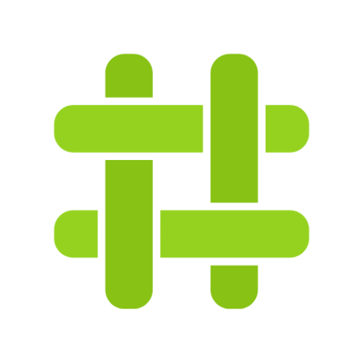

# Shutdown Tools 

A collection of tools, websites, strategies that could be used by HRDs, journalists, and anyone, **during internet outages**. 

If you would like to help in categorising these projects, please submit a pull request to [this repo](https://github.com/stayteef/shutdown.tools).

----

# Data and Metadata Redaction

<!--
CARD STRUCTURE
- Each tool is wrapped in 
 ... 
 so it gets a
  visible border (see extra.css). This is what separates tools clearly.
- Two buttons only: Official website + Download.
- "Risks" = amber box (warning type)  -> potential / implied risk, use bullets.
- "Warning" = red box (danger type)   -> more alarming, definite caution.
- "Target" line is for communication tools (who you reach). Delete if N/A.
-->

**Protects against the following threat(s):**

- [:material-account-group: Public Exposuree](#){ .md-button }

When sharing files, remove associated metadata first. Image files often embed
Exif data, and photos can even include GPS coordinates.

!!! danger "Warning"

    Never use blur to redact text in images. To redact text, draw a solid box
    over it instead.

---

## BLANK TEMPLATE — copy for each tool

{ align=right width=88 }

### Tool Name

**Tool Name** is a one-line description of what it does and who it's for.

**Platforms:** :simple-android: :simple-apple: :material-web:  
**Open source:** :material-check: &nbsp;·&nbsp; **Non-profit:** :material-check:  
**Target:** In-country friends / Public posting

[:octicons-globe-16: Official website](https://example.com){ .md-button }
[:octicons-download-16: Download](https://example.com){ .md-button }

!!! warning "Risks"

    - First potential risk to be aware of.
    - Second one, if there is another.

!!! danger "Warning"

    A stronger, more alarming caution. Delete this block unless it's serious.

---

## FILLED EXAMPLES — for reference

{ align=right width=88 }

### Signal

**Signal** is an encrypted messenger for private one-to-one and group
conversations and calls, backed by a non-profit foundation.

**Platforms:** :simple-android: :simple-apple: :material-web:  
**Open source:** :material-check: &nbsp;·&nbsp; **Non-profit:** :material-check:  
**Target:** In-country friends

[:octicons-globe-16: Official website](https://signal.org){ .md-button }
[:octicons-download-16: Download](https://signal.org/download/){ .md-button }

!!! warning "Risks"

    - Requires a phone number to register, which is tied to your identity.

{ align=right width=88 }

### Briar

**Briar** is peer-to-peer messaging that works without central servers,
connecting directly over Bluetooth, Wi-Fi, or Tor.

**Platforms:** :simple-android:  
**Open source:** :material-check: &nbsp;·&nbsp; **Non-profit:** :material-check:  
**Target:** In-country friends

[:octicons-globe-16: Official website](https://briarproject.org){ .md-button }
[:octicons-download-16: Download](https://briarproject.org/#download){ .md-button }

!!! warning "Risks"

    - Android only — everyone you message must also be on Android.
    - Devices only sync when they can reach each other directly.

!!! danger "Warning"

    Metadata may be visible to anyone monitoring your local network if you
    connect over Wi-Fi rather than Tor.

