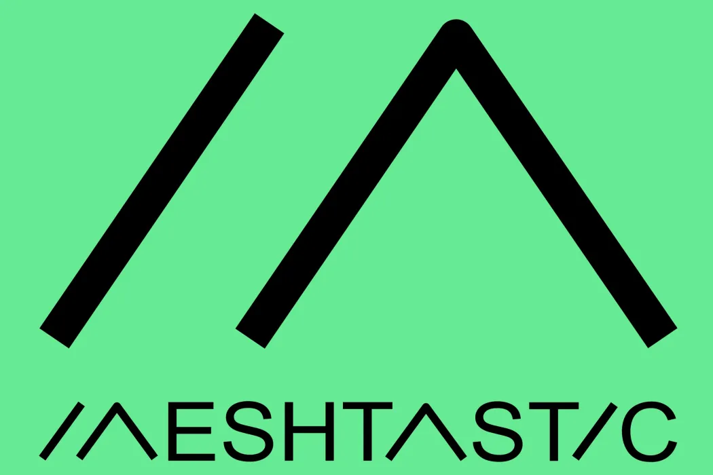
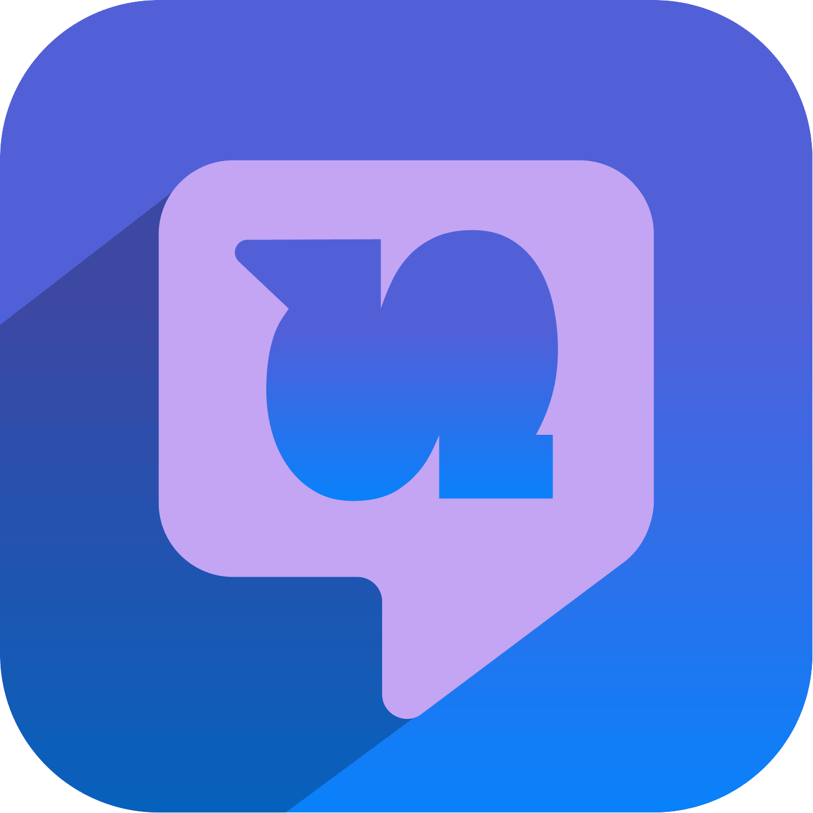
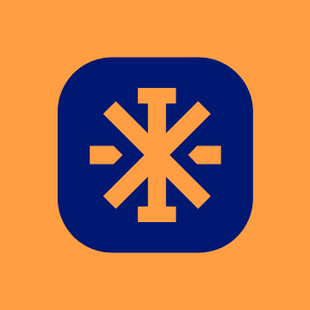
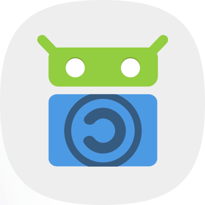
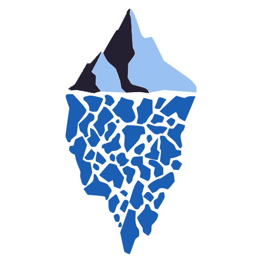
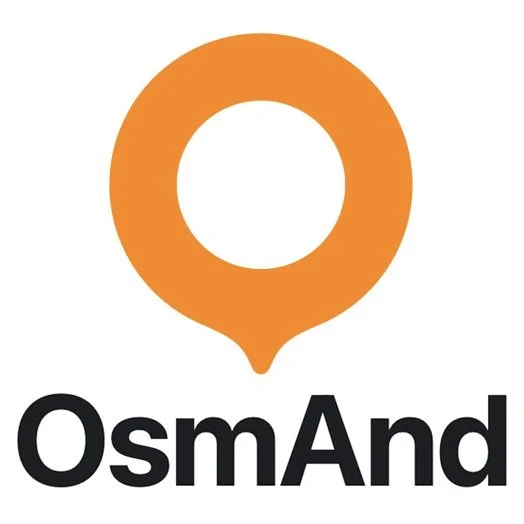

# Shutdown Tools 

A collection of tools, websites, strategies that could be used by HRDs, journalists, and anyone, **during internet outages**. 

If you are a tool developer and think your tool should be included in this directory, or would like to submit user feedback for a tools, please contact the team at hello@shutdown.tools. 

If you would like to help in categorising these projects, please submit a pull request to [this repo](https://github.com/stayteef/shutdown.tools).

Tools in each cateogory is arrnaged in alphitical order. 

----

### Communication

<!-- Briar -->

<!-- LOGO-->
{ align=right width=88 }

<!-- NAME -->
#### Briar

<!-- description-->
Briar is peer-to-peer messaging that allows you to message other Briar users located within 300 meters without the Internet. privately connect via Bluetooth, Wi-Fi or Tor. 

It is for contact people nearby you, but not a specific contact in another location. 

<!-- info-->
**Platforms:** [:simple-android:](URL){ title="Android" } [:simple-apple:](URL){ title="iOS" } [:simple-fdroid:](URL){ title="F-Droid" }
**Open source:** :material-close:
**Last Updated:** 26 Aug 2026

[:octicons-globe-16: Official website](https://briarproject.org/){ .md-button }

<!-- RISKS -->
!!! danger "Risks"

    TBC

<!-- Bridgefy -->

<!-- LOGO-->
{ align=right width=88 }

<!-- NAME -->
#### Bridgefy

<!-- description-->
**Bridgefy** is a tool that you can send encrypted messages woth other Bridgefy users within 100 meeters by Bluetooth without internet. It allows texts, voice notes and locations. 

<!-- info-->
**Platforms:** [:simple-android:](https://play.google.com/store/apps/details?id=me.bridgefy.main){ title="Android" } [:simple-apple:](https://apps.apple.com/us/app/bridgefy-offline-messages/id975776347){ title="iOS" }
**Open source:** :material-close:
**Last Updated:** 26 Aug 2026

[:octicons-globe-16: Official website](https://bridgefy.me/){ .md-button }

<!-- REVIEWS-->
??? quote "User reviews"

    "It only works within 100 meters, which is quite a short distance. It also falsely claims Hong Kong protesters used it a lot during the protest. People only installed it, but there was never an internet shutdown so no one actually used it. So, lack of real use cases." — Anonymous, Hong Kong, Sept 2026

<!-- Deku SMS -->

<!-- LOGO-->
{ align=right width=88 }

<!-- NAME -->
#### Deku SMS

<!-- description-->
Deku SMS is an app that allows you to encrypt your SMS. In some cases, SMS still works when the Internet is down, but it is not encryped which means the carrier and the autheoties can see everything you're sending. With SMS end to end encroytion it prevents others to see the content of your SMS.

<!-- info-->
**Platforms:** [:simple-android:](URL){ title="Android" } [:simple-apple:](URL){ title="iOS" }
**Open source:** :material-check:
**Last Updated:** 

[:octicons-globe-16: Official website](https://dekusms.com/){ .md-button }

!!! warning "Test before use"

    Encroyting your SMS would cost more money than normal SMS, because it ill be longer. Check:

    - if Deku works for your phone, 
    - make sure your mobile plan allow you to send SMS and you have enpugh credit 
    - test with the people you want to be in touch with the most to make sure it works between you and them, and that they also have the app install.  

<!-- Delta Chat -->

<!-- LOGO-->
{ align=right width=88 }

<!-- NAME -->
#### Delta Chat

<!-- description-->
⚠️ **Require setting up servers in a region to work offline**

**Delta Chat** is a secure instant messaging app, with interactive in-chat apps for gaming and collaboration, that runs on email infrastructure. This means it does not run on a centralised server owned by one company, such as WhatsApp. So it cannot easily be blocked, and if volunteers set up the right servers in your area ahead of time, Delta Chat can keep working during an internet shutdown.

<!-- info-->
**Platforms:** [:simple-android:](https://play.google.com/store/apps/details?id=chat.delta){ title="Android" } [:simple-apple:](https://apps.apple.com/us/app/delta-chat/id1459523234){ title="iOS" } [:fontawesome-brands-windows:](https://apps.microsoft.com/detail/9pjtxx7hn3pk){ title="Windows" } [:material-apple:](https://apps.apple.com/us/app/delta-chat-desktop/id1462750497){ title="macOS" } [:simple-linux:](https://flathub.org/en/apps/chat.delta.desktop){ title="Linux" }
**Open source:** :material-check:
**Last Updated:** 
:material-server: Server Setup Required

[:octicons-globe-16: Official website](https://delta.chat/en/){ .md-button }

!!! warning "Set up server for the community in advance"

    For Delta Chat to work during a shutdown, the servers need to be set up ahead of time, while the internet is still up. Volunteers with the technical skills can set up and test these servers in advance. It's free to use, and [setting up a server](https://chatmail.at/doc/relay/) is relatively inexpensive. A basic Chatmail relay server, running on minimal specs like 1 CPU and 1GB RAM, can support a few thousand active users.

<!-- Meshtastic -->

<!-- LOGO-->
{ align=right width=88 }

<!-- NAME -->
#### Meshtastic

<!-- description-->
Meshtastic® is a project that lets you use their inexpensive [LoRa][lora] radio devices to send text messages to other people with no internet or phone signal. Each device is good for a few kilometers on its own, but because every device also passes along messages for others, a group of them forms a mesh that can reach much further, across a whole town or city.

<!-- info-->
**Platforms:** [:simple-android:](https://play.google.com/store/apps/details?id=com.geeksville.mesh){ title="Android" } [:simple-apple:](https://apps.apple.com/us/app/meshtastic/id1586432531){ title="iOS / macOS" } [:simple-fdroid:](https://f-droid.org/en/packages/com.geeksville.mesh/){ title="F-Droid" } [:material-web:](https://client.meshtastic.org){ title="Web" } :material-chip:{ title="Hardware" }
**Open source:** :material-check:
**Last Updated:** 
:material-chip: Hardware required

[:octicons-globe-16: Official website](https://meshtastic.org/){ .md-button }

!!! warning "Hardware required"

    You will need to purchase their hardware in advance. 

<!-- Shout Messages -->

<!-- LOGO-->
{ align=right width=88 }

<!-- NAME -->
#### Shout Messages

<!-- description-->
**Shout Messages** is an app that allows you to encrypt your SMS, and image. In some cases, SMS still works when the Internet is down, but it is not encryped which means the carrier and the autheoties can see everything you're sending. With SMS end to end encroytion it prevents others to see the content of your SMS.

<!-- info-->
**Platforms:** [:simple-android:](URL){ title="Android" }
**Open source:** :material-check:
**Last Updated:** 
:material-flask: In beta

[:octicons-globe-16: Official website](https://www.shout.tools/){ .md-button }

!!! warning "Test before use"

    Encryting your SMS would cost more money than normal SMS, because it ill be longer. Check:

    - if Deku works for your phone, 
    - make sure your mobile plan allow you to send SMS and you have enpugh credit 
    - test with the people you want to be in touch with the most to make sure it works between you and them, and that they also have the app install.  

!!! danger "Risks"

    - Authorities will be able to see a large amount of ciphertext being sent from your number, althpugh they will not know what they mean, but it is possuble it look suspisious. Especially when in country ehere your SIM is registered with your ID. Assess your risk level before deciding to use it. 

!!! warning "Cost"

    - Sending images will cost a lot of SMSs, it can be costly if you don't have unlimited SMS plan

!!! warning "Unstable International SMS"

    - Sending SMS across countries is less stable than sending within one country.

### Content Distribution

<!-- RelaySMS -->

<!-- LOGO-->
{ align=right width=88 }

<!-- NAME -->
#### RelaySMS

<!-- description-->
RelaySMS enables users to send messages to online platforms, including twitter, Gmail, telegram, without the use of an active internet connection via encrypted SMS.

<!-- info-->
**Platforms:** [:simple-android:](https://play.google.com/store/apps/details?id=com.afkanerd.sw0b){ title="Android" } [:simple-apple:](https://apps.apple.com/us/app/relaysms/id6630382970){ title="iOS" }
**Open source:** :material-check:
**Last Updated:** 
:material-server: Server Setup Required

[:octicons-globe-16: Official website](https://relay.smswithoutborders.com/){ .md-button }

!!! danger "Risks"

    - Authorities will be able to see a large amount of ciphertext being sent from your number, althpugh they will not know what they mean, but it is possuble it look suspisious. Especially when in country ehere your SIM is registered with your ID. Assess your risk level before deciding to use it. 

!!! warning "Might need to set up Routing Numbers / Gateway Clients in advance"

    RelaySMS depends entirely on **routing numbers**. It works by sending your message as a normal SMS from your phone to a routing number, a phone or device somewhere with a working internet connection, which then forwards your message on to the internet for you. 

    The app comes with a few routing numbers set up by the RelaySMS team, but anyone with the technical skills can [set up and host their own routing number](https://docs.smswithoutborders.com/docs/Gateway%20Clients%20Guide/GatewayClientsGuide) for their region. The more routing numbers running in an area, the more people can stay connected during an internet shutdown.

<!-- Butter Box -->

<!-- LOGO-->
{ align=right width=88 }

<!-- NAME -->
#### Butter Box

<!-- description-->
**Butter Box** is a lightweight, portable device that works like a hard drive with its own Wi-Fi hotspot. Place it in a public location, and anyone nearby can connect to it and view or download its pre-made content packs, with no internet required. From a content pack, people can get essential files such as app [APKs][apk] (like Tella or other encrypted messengers), read educational PDFs and offline Wikipedia, and communicate locally through encrypted mesh chat rooms (Matrix).

One use case: you set up a Butter Box with content you think is useful for your community, place it somewhere people can reach, and the people you know can go to that location to download the files and use the chat room.

<!-- info-->
**Platforms:** :material-chip:{ title="Hardware" }
**Open source:** :material-check:
**Last Updated:** 
:material-chip: Hardware required

[:octicons-globe-16: Official website](https://likebutter.app/){ .md-button }

!!! info "Who needs what"

    **If you run a Butter Box (the moderator):** you need the hardware, plus all the content you want to share loaded onto it while you still have internet.

    **Visitor:** only need a phone or laptop with a web browser. Connect to the Butter Box's Wi-Fi and open its pages in your browser. No app to install.

### File Sharing

<!-- Tella -->

<!-- LOGO-->
{ align=right width=88 }

<!-- NAME -->
#### Tella

<!-- description-->
**Tella**'s Nearby Sharing feature allows users to securely share files offline between devices in close physical proximity, across platforms including iOS, Android, macOS, Windows, and Linux, regardless of device brand or model, and can be used on any device where Tella is installed. You can see it as a cross-platform airdrop. 

<!-- info-->
**Platforms:** [:simple-android:](https://play.google.com/store/apps/details?id=org.hzontal.tella){ title="Android" } [:simple-apple:](https://apps.apple.com/us/app/tella-document-protect/id1598152580){ title="iOS" } [:simple-fdroid:](https://f-droid.org/en/packages/org.hzontal.tellaFOSS/){ title="F-Droid" } [:fontawesome-brands-windows:](https://github.com/Horizontal-org/Tella-Desktop/releases/){ title="Windows" } [:material-apple:](https://github.com/Horizontal-org/Tella-Desktop/releases/){ title="macOS" } [:simple-linux:](https://github.com/Horizontal-org/Tella-Desktop/releases/){ title="Linux" }
**Open source:** :material-check:
**Last Updated:** 

[:octicons-globe-16: Official website](https://tella.app/){ .md-button }

<!-- F-Droid Nearby -->

<!-- LOGO-->
{ align=right width=88 }

<!-- NAME -->
#### F-Droid Nearby

<!-- description-->
**F-Droid Nearby** is the built-in Nearby feature of the [F-Droid](https://f-droid.org/en/) client app that allows users to exchange apps device-to-device in close physical proximity, locally without internet access. 

<!-- info-->
**Platforms:** [:simple-fdroid:](https://f-droid.org/en/docs/Get_F-Droid/#option-2-download-and-install-f-droid-apk){ title="F-Droid" }
**Open source:** :material-check:
**Last Updated:** 

[:octicons-globe-16: Official website](https://f-droid.org/en/packages/org.fdroid.nearby/){ .md-button }

<!-- USB Dead Drop -->

<!-- NAME -->
#### USB Dead Drop

<!-- description-->
**USB dead drop** is a USB flash drive left in a public place for anyone to use. You can pre-load it with the content you want to distribute, such as app [APKs][apk], videos, or PDFs, so people can plug in and copy the files with no internet needed.

!!! warning "Be careful what you plug in"

    - Only use dead drops you trust. A drive can carry malware that installs itself the moment it's connected. 
    - If you can, open them on a spare or old device rather than your main phone or computer in case the USB is contaminated.

!!! warning "Remove metadata first"

    Files like photos, videos, and PDFs can carry hidden [metadata][metadata] that might reveal who made them, where, and when. Strip this before putting files on the drive, so they can't be traced back to you as the USB will be placed in a public place. 

    See [Metadata Removal](#metadata-removal) for tools.

<!-- Built-in Phone Sharing -->

<!-- NAME -->
#### Built-in Phone Sharing

<!-- description-->
Most phones already have a built-in way to send files directly to nearby devices with no internet: **AirDrop** on iPhone and **Quick Share** (formerly Nearby Share) on Android. 

They use Bluetooth and Wi-Fi to connect two devices directly, so you can pass photos, videos, and files to someone next to you even during a full shutdown. Both are end-to-end encrypted.

!!! warning "Not cross-platform"

    - AirDrop and Quick Share usually only work between the same type of device (iPhone to iPhone, Android to Android). For cross-platform sharing, use [Tella](#tella) instead.

!!! danger "Turn it off when not in use"

    - Keep the feature turned **off** when you're not using it. Leaving it open to everyone lets strangers see your device and send you unwanted or malicious files.

### Metadata Removal

<!-- Exif Eraser -->

<!-- LOGO-->
{ align=right width=88 }

<!-- NAME -->
#### Exif Eraser

<!-- description-->
**Exif Eraser** is a one-line description of what it does and how it helps during a shutdown.

<!-- info-->
**Platforms:** [:simple-android:](https://play.google.com/store/apps/details?id=com.none.tom.exiferaser){ title="Android" } [:material-download-box:](https://github.com/Tommy-Geenexus/exif-eraser){ title="APK" }
**Open source:** :material-check:
**Last Updated:** 

[:octicons-globe-16: Official website](https://github.com/Tommy-Geenexus/exif-eraser){ .md-button }

<!-- Scrambled Exif -->

<!-- LOGO-->
{ align=right width=88 }

<!-- NAME -->
#### Scrambled Exif

<!-- description-->
**Scrambled Exif** is a one-line description of what it does and how it helps during a shutdown.

<!-- info-->
**Platforms:** [:simple-android:](https://play.google.com/store/apps/details?id=com.jarsilio.android.scrambledeggsif){ title="Android" } [:simple-fdroid:](https://f-droid.org/packages/com.jarsilio.android.scrambledeggsif/){ title="F-Droid" } [:material-download-box:](https://gitlab.com/juanitobananas/scrambled-exif/-/releases){ title="APK" }
**Open source:** :material-check:
**Last Updated:** 

[:octicons-globe-16: Official website](https://gitlab.com/juanitobananas/scrambled-exif){ .md-button }

<!-- ExifCleaner -->

<!-- LOGO-->
{ align=right width=88 }

<!-- NAME -->
#### ExifCleaner

<!-- description-->
**ExifCleaner** is a one-line description of what it does and how it helps during a shutdown.

<!-- info-->
**Platforms:** [:fontawesome-brands-windows:](https://github.com/szTheory/exifcleaner/releases){ title="Windows" } [:material-apple:](https://github.com/szTheory/exifcleaner/releases){ title="macOS" } [:simple-linux:](https://github.com/szTheory/exifcleaner/releases){ title="Linux" }
**Open source:** :material-check:
**Last Updated:** 

[:octicons-globe-16: Official website](https://exifcleaner.com/){ .md-button }

<!-- Metadata Cleaner -->

<!-- LOGO-->
{ align=right width=88 }

<!-- NAME -->
#### Metadata Cleaner

<!-- description-->
**Metadata Cleaner** is a one-line description of what it does and how it helps during a shutdown.

<!-- info-->
**Platforms:** [:simple-linux:](https://flathub.org/apps/details/io.gitlab.metadatacleaner.metadatacleaner){ title="Linux" }
**Open source:** :material-check:
**Last Updated:** 

[:octicons-globe-16: Official website](https://gitlab.com/metadatacleaner/metadatacleaner){ .md-button }

<!-- Mat2 -->

<!-- LOGO-->
{ align=right width=88 }

<!-- NAME -->
#### Mat2

<!-- description-->
**Mat2** (Metadata Anonymisation Toolkit 2) is a cross-platform tool for removing metadata from several file formats. It provides both a command line tool and [a graphical user interface](https://metadata.systemli.org/). 

<!-- info-->
**Platforms:** [:material-apple:](https://github.com/jvoisin/mat2#requirements-setup-on-macos-os-x-using-homebrew){ title="macOS" } [:simple-linux:](https://github.com/jvoisin/mat2){ title="Linux" } [:material-web:](https://metadata.systemli.org/){ title="Web" }
**Open source:** :material-check:
**Last Updated:** 
:material-console: Command line tool

[:octicons-globe-16: Official website](https://github.com/jvoisin/mat2){ .md-button }

<!-- Shortcuts (iOS & macOS) -->

<!-- NAME -->
#### Shortcuts (iOS & macOS)

<!-- description-->
On iOS and macOS, you can remove image metadata without using any third-party apps by creating a [shortcut](https://apps.apple.com/app/id915249334) for this purpose. Here is an example shortcut you can download to use as is:

[Clean Image Metadata](https://icloud.com/shortcuts/fb774ddb7b5b4296871776c67ac0fff9){ .md-button .md-button--primary }

You can also use it as a model for your own shortcut; just make sure that the Preserve Metadata option under the Convert action is unchecked. Once added, you can access the shortcut in the share sheet that appears when you select the Share button. You can select multiple images and invoke the shortcut to remove their metadata all at once.

This shortcut removes metadata such as location, device model, lens model, and other camera information. It also sets the image creation date to the time the shortcut was used.

*Source: [Privacy Guides](https://www.privacyguides.org).*

### Map

<!-- OsmAnd -->

<!-- LOGO-->
{ align=right width=88 }

<!-- NAME -->
#### OsmAnd

<!-- description-->
**OsmAnd** is a world map app based on OpenStreetMap (OSM), but built specifically for offline use. All map data can be stored on users' devices for offline use, while still offering routing, with optical and voice guidance, for car, bike, and pedestrian usage. All main functionalities work both online and offline (no internet needed). OsmAnd does not collect user data.

<!-- info-->
**Platforms:** [:simple-android:](https://play.google.com/store/apps/details?id=net.osmand){ title="Android" } [:simple-apple:](https://apps.apple.com/us/app/osmand-maps-travel-navigate/id934850257){ title="iOS" }
**Open source:** :material-check:
**Last Updated:** 

[:octicons-globe-16: Official website](https://osmand.net/){ .md-button }

!!! info "What to prepare and watch out for"

    - **Download your maps in advance.** OsmAnd only works offline if you download your region's maps while you still have internet. Do this before a shutdown.
    - **GPS needs a clear view of the sky.** It can be weak or fail indoors, underground, or between tall buildings.
    - **First location fix may be slow.** Without internet, your phone can take longer to find your position. Give it a few minutes.

!!! warning "In conflict areas"

    In some conflict zones, authorities or militaries jam or fake GPS signals, which can make your location wrong or unavailable. This is separate from an internet shutdown and can't be fixed from your phone.

### Secure Documentation

<!-- eyeWitness to Atrocities -->

<!-- LOGO-->
{ align=right width=88 }

<!-- NAME -->
#### eyeWitness to Atrocities

<!-- description-->
The **eyeWitness to Atrocities** app lets users capture tamper-proof video and photo, such as evidence of war crimes and police brutality, by embedding metadata to prove the reliability and validity of footage. One of the use cases is to verify their authenticity in court.

<!-- info-->
**Platforms:** [:simple-android:](https://play.google.com/store/apps/details?id=com.camera.easy&hl=en){ title="Android" }
**Open source:** :material-close:
**Last Updated:** 

[:octicons-globe-16: Official website](https://www.eyewitness.global/){ .md-button }

<!-- Tella -->

<!-- LOGO-->
{ align=right width=88 }

<!-- NAME -->
#### Tella

<!-- description-->
**Tella** encrypts and hides your files and gallery. It also works as a camera: when you take photos, videos, or audio directly in the app, it encrypts them automatically and immediately. You can also upload existing files into it. So if authorities search your phone and look through your album or recordings, they won't see anything stored in Tella.

<!-- info-->
**Platforms:** [:simple-android:](https://play.google.com/store/apps/details?id=org.hzontal.tella){ title="Android" } [:simple-apple:](https://apps.apple.com/us/app/tella-document-protect/id1598152580){ title="iOS" } [:simple-fdroid:](https://f-droid.org/en/packages/org.hzontal.tellaFOSS/){ title="F-Droid" }
**Open source:** :material-check:
**Last Updated:** 

[:octicons-globe-16: Official website](https://tella-app.org/){ .md-button }

!!! info "More features and settings"

    Tella has a lot of settings to protect you and your data. Some of the key ones:

    - **Screen security:** blocks screenshots and screen recording (can be disabled).
    - **Camouflage:** make the app look like a weather app, so it doesn't stand out (not available on iOS).
    - **Quick delete:** wipe sensitive data in seconds, in case of arrest or other emergencies.

### Browser

<!-- Ceno Browser -->

<!-- LOGO-->
{ align=right width=88 }

<!-- NAME -->
#### Ceno Browser

<!-- description-->
**Ceno Browser** is a decentralized mobile web browser designed to keep some connectivity during network blackouts. It uses peer-to-peer technology, so instead of loading a page only from the website itself, it can fetch what other Ceno users have already seen. Ceno still needs some kind of network path to reach other users or the helper servers, for example someone in the country with Ceno installed who still has internet access (such as through Starlink, or because they work in government). But it cannot work where no network path exists at all.

<!-- info-->
**Platforms:** [:simple-apple:](https://apps.apple.com/us/app/ceno-browser/id6673915387){ title="iOS" } [:simple-android:](https://play.google.com/store/apps/details?id=ie.equalit.ceno){ title="Android" } [:fontawesome-brands-windows:](https://ceno-download.s3.amazonaws.com/ceno-desktop/latest/ceno-win64-portable.html){ title="Windows" }
**Open source:** :material-check:
**Last Updated:** 

[:octicons-globe-16: Official website](https://ceno.app/en/index.html){ .md-button }

!!! warning "Risks"

    - Ceno is not anonymous. There are different ways people can see your [IP][ip], for example in Public mode, or through helper servers (Injectors and Bridges).
    - It can use a lot of data.

    Use Personal mode to stay off the sharing network. For more, see the [Ceno FAQ](https://ceno.app/faq/).

### VPN

> ⚠️ **A VPN needs some internet connection to work, so it does not work during a full shutdown.** ⚠️

There are multiple VPNs on the market, and we have not included all of them. Our standard criteria include providers that meet at least some of the following: open source, strong encryption, independent security audits, a no-logs policy, a track record of supporting human rights, and not being owned by data mining companies. However, each VPN operates differently with various protocols. We recommend ensuring it works in your region.

<!-- NAME -->
#### VPN Providers

<!-- info-->
| Provider   | Countries                          | Free Version? | Anonymous Payments     |
|------------|------------------------------------|---------------|------------------------|
| [**Proton**](https://protonvpn.com)       | 112+           | Yes           | Cash                   |
| [**IVPN**](https://www.ivpn.net)          | 37+            | No            | Monero, Cash           |
| [**Mullvad**](https://mullvad.net)        | 49+            | No            | Monero, Cash           |
| [**Psiphon**](https://psiphon.ca)         | 20+            | Yes           | No                     |
| [**Lantern**](https://getlantern.org)     | No customized server location | Yes           | No                     |
| [**Nym**](https://nymtech.net)            | 85             | No            | Monero                 |
| [**Tunnelbear**](https://www.tunnelbear.com) | 47          | Yes           | No                     |
| [**Orbot**](https://orbot.app/)           | N/A            | Yes           | Free                   |

!!! danger "Risks"

    - Using VPNs may be illegal in some countries.
    - VPNs require a small amount of data to connect, making them ineffective during a full shutdown but potentially useful during throttling.

### Alternative Internet

<!-- e-SIM -->

<!-- NAME -->
#### e-SIM

<!-- description-->
Using an **e-SIM** allows you to activate a foreign mobile data plan without needing to insert a physical card into your device. It enables you to switch between different mobile networks and access alternative providers that may still be operational, ensuring connectivity even when local networks are restricted.

<!-- info-->
**Platforms:** :simple-android:{ title="Android" } :simple-apple:{ title="iOS" }

!!! danger "Risks"

    - It may not be a good solution in areas with a complete network outage, or where all providers are affected.

!!! warning "Must test first"

    - Get the e-SIM BEFORE a shutdown happens, and test that it actually works on your device and carrier. You need to make sure.

<!-- Starlink -->

<!-- LOGO-->
{ align=right width=88 }

<!-- NAME -->
#### Starlink

<!-- description-->
**Starlink** is a satellite internet service from SpaceX that provides high-speed, low-latency internet by connecting directly to satellites, bypassing the local internet providers that governments often control.

<!-- info-->
**Platforms:** :material-chip:{ title="Hardware" }
**Open source:** :material-close:
:material-chip: Hardware required

[:octicons-globe-16: Official website](https://www.starlink.com/){ .md-button }

!!! warning "Cost"

    - A one-time hardware kit (the dish and router). The standard kit is around $349, and the smaller portable Starlink Mini is around $200 to $250. Prices vary by country and go on sale often.
    - A monthly subscription, usually somewhere between $50 and $130 depending on your plan and region. No contract, so you can pause or cancel.
    - Prices change often, so check your own address on Starlink's website for the real figure.

!!! danger "Risks"

    - In some countries it is illegal to obtain or use Starlink.
    - The dish is physical and needs a clear view of the sky, so it can be visible to others. If you don't want to be detected, be careful about where you place it and unplug it when not in use.

